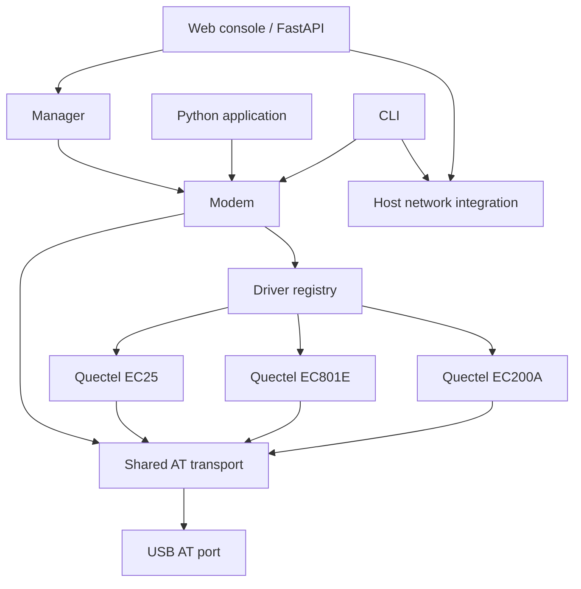

# Architecture

[Documentation](README.md) · [简体中文](zh-CN/architecture.md)

Cellulary exposes one device API while keeping vendor/model behavior separate from serial transport and operating-system networking.

## Responsibilities

| Location | Responsibility |
| --- | --- |
| `transport.py` | Serial transactions, timeouts, final responses, prompts and unsolicited result codes (URCs) |
| `sms.py` | PDU encoding/decoding, GSM 7-bit/UCS2 and concatenated-message handling |
| `modem.py` | Public device API, common operations, synchronization and driver delegation |
| `drivers/base.py` | Driver interface, conservative defaults, registration and selection |
| `drivers/quectel/base.py` | Shared Quectel call and QNETDEV behavior where applicable |
| `drivers/quectel/ec200a.py` | EC200A profile, supported operations and regional capability boundaries |
| `drivers/quectel/ec801e.py` | EC801E USB data behavior, firmware-sensitive SMS checks and voice/GNSS restrictions |
| `drivers/quectel/ec25.py` | EC25 protocol implementation, including optional QGPS GNSS behavior |
| `discovery.py`, `manager.py` | Candidate-port discovery, device lifecycle and status snapshots |
| `network.py` | Windows network interfaces and existing mobile broadband profiles |
| `cli.py`, `web/` | User interfaces built on the device and host-network APIs |

`Modem` owns the serial transport. Drivers receive the command interface and device identity; they do not open a second connection. Operations on one modem are serialized, while separate modems can be managed independently. URCs must not be mistaken for command responses.

## Capability reporting

A driver declares documented capability and its verification level. Runtime probes refine firmware-dependent features. Do not collapse unknown, unsupported, no SIM, receiver disabled and no GNSS fix into one boolean error.

`subscriber_numbers()` returns SIM-stored records and a primary number, or an explicit unavailable reason. `status()` includes the cached result under `sim`; it never substitutes an IMSI or ICCID for a phone number.

`gnss_status()` and `gnss_location()` distinguish support, receiver state and fix state. `start_gnss()` and `stop_gnss()` are explicit controls. EC25 implements these with its own QGPS commands. EC200A-EU and EC801E do not inherit EC25 GNSS simply because all three use Quectel AT firmware.

`status().radio` exposes reported radio technology, operator PLMN, band and channel when available. A numeric PLMN is retained as such; an empty operator-name response does not justify inventing a carrier label.

## Adding a vendor or model

1. Read the applicable hardware and AT manuals and record the sources.
2. Add a module under `drivers/<vendor>/` deriving from `ModemDriver` or a suitable vendor base.
3. Give it a unique profile and an identity matcher. Use manufacturer/model/firmware evidence, not USB ID alone.
4. Implement only verified command behavior; reuse common protocol code and keep model-specific branches in the driver.
5. Register/import the driver through the package registry. Inspect existing Quectel drivers for the current interface.
6. Test success, unsupported responses, malformed data, timeouts and interleaved notifications with simulated transport.
7. Record physical validation separately, including firmware and the operations actually exercised.

A protocol test is not a carrier acceptance test. Preserve the distinction in driver metadata and documentation. EC25 currently demonstrates this: implemented and protocol-tested, awaiting physical validation.

## Host networking and the web boundary

PDP state belongs to the modem. DHCP, interfaces, routes and DNS belong to the operating system. Keep host-network actions separate so an AT `OK` cannot be reported as verified Internet connectivity.

The web service binds locally by default. Write operations pass origin/host and session-token checks and call the same device methods used by Python/CLI. API schemas are generated at `/docs`; consumers should use those schemas rather than duplicate driver command logic in the browser.
