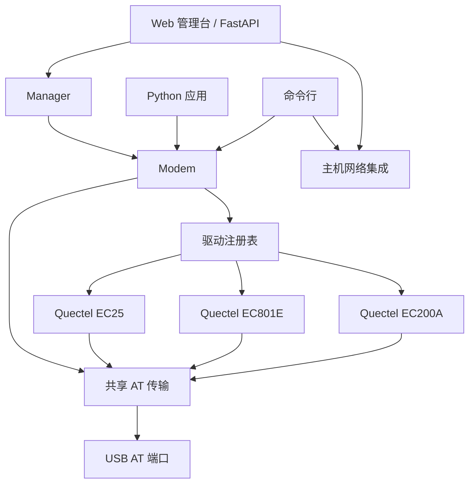

# 架构

[文档目录](README.md) · [English](../architecture.md)

Cellulary 提供统一设备 API，同时将厂商/型号行为与串口传输、操作系统网络分开。

## 职责

| 位置 | 职责 |
| --- | --- |
| `transport.py` | 串口事务、超时、结束响应、输入提示与异步结果码（URC） |
| `sms.py` | PDU 编解码、GSM 7-bit/UCS2 及长短信处理 |
| `modem.py` | 公共设备 API、通用操作、同步与驱动委派 |
| `drivers/base.py` | 驱动接口、保守默认值、注册和选择 |
| `drivers/quectel/base.py` | 适用时共享移远通话与 QNETDEV 行为 |
| `drivers/quectel/ec200a.py` | EC200A 配置、操作与地区变体能力边界 |
| `drivers/quectel/ec801e.py` | EC801E USB 数据、短信固件探测及语音/GNSS 限制 |
| `drivers/quectel/ec25.py` | EC25 协议实现与可选 QGPS GNSS 行为 |
| `discovery.py`、`manager.py` | 候选端口发现、设备生命周期与状态快照 |
| `network.py` | Windows 网络接口及已有移动宽带配置 |
| `cli.py`、`web/` | 基于设备和主机网络 API 的用户界面 |

串口由 `Modem` 持有。驱动获得命令接口与设备身份，不自行建立第二个连接。同一模块的操作串行执行，不同模块可以独立管理。URC 不能误认为命令响应。

## 能力反馈

驱动声明资料支持的能力与验证程度，再用运行时探测处理固件差异。未知、不支持、无 SIM、接收器关闭、GNSS 尚无定位不能合并成同一个错误。

`subscriber_numbers()` 返回 SIM 保存的号码记录及首选号，或明确不可用原因。`status()` 在 `sim` 中包含缓存结果，不会把 IMSI/ICCID 当作电话号码。

`gnss_status()`、`gnss_location()` 区分支持状态、接收器状态和定位状态；`start_gnss()`、`stop_gnss()` 是显式控制。EC25 使用自己的 QGPS 命令，EC200A-EU 与 EC801E 不会因同属移远而继承其 GNSS 能力。

`status().radio` 在模块提供信息时返回无线制式、运营商 PLMN、频段与信道。数字 PLMN 保留为数字标识；运营商名称响应为空时，不推断或编造品牌名。

## 新增厂商或型号

1. 阅读对应硬件与 AT 手册，并登记来源。
2. 在 `drivers/<vendor>/` 下派生 `ModemDriver` 或合适的厂商基类。
3. 定义唯一配置及身份匹配规则，依据厂商/型号/固件，而非只看 USB ID。
4. 仅实现已核对的命令行为，共用通用协议，把型号差异放在驱动中。
5. 通过包注册表注册/导入驱动，参考现有移远驱动的接口。
6. 使用模拟传输测试成功、不支持、格式错误、超时和交错通知。
7. 单独记录真机验证，包括固件版本及实际执行的操作。

协议测试不等于运营商验收。驱动元信息与文档必须保留区别；EC25 当前即为已实现并经过协议测试、等待真机验证的状态。

## 主机网络与 Web 边界

PDP 状态属于模块，DHCP、网卡、路由与 DNS 属于操作系统。主机网络操作应独立，不能把 AT `OK` 显示成已验证上网。

Web 默认在本机提供服务。写操作经过来源/Host 与会话令牌校验，再调用 Python/CLI 共用的设备方法。API 结构由 `/docs` 生成，浏览器不应另行复制驱动命令逻辑。
